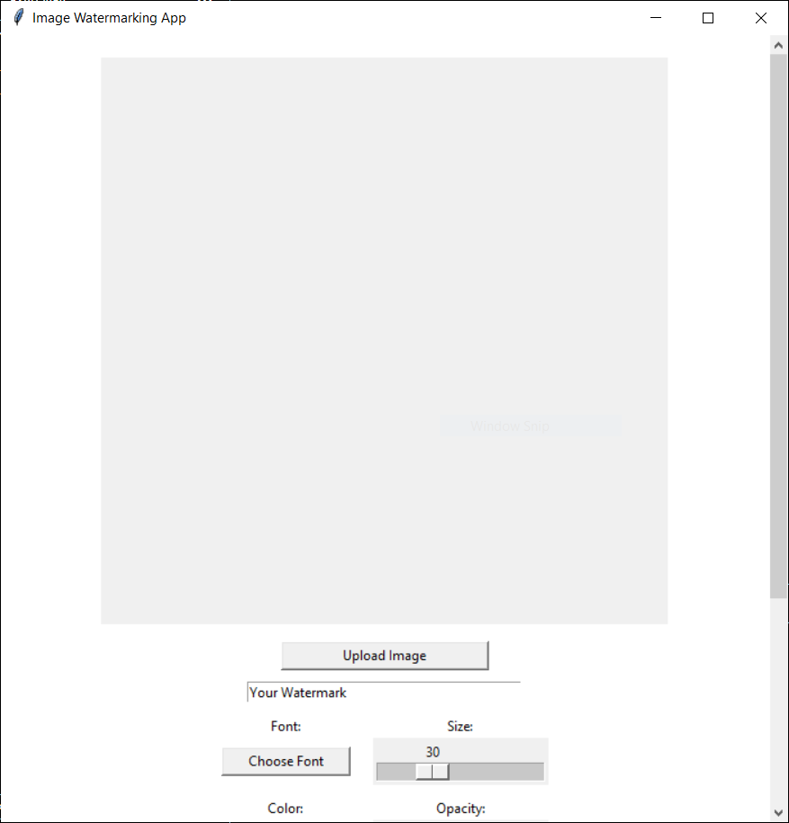
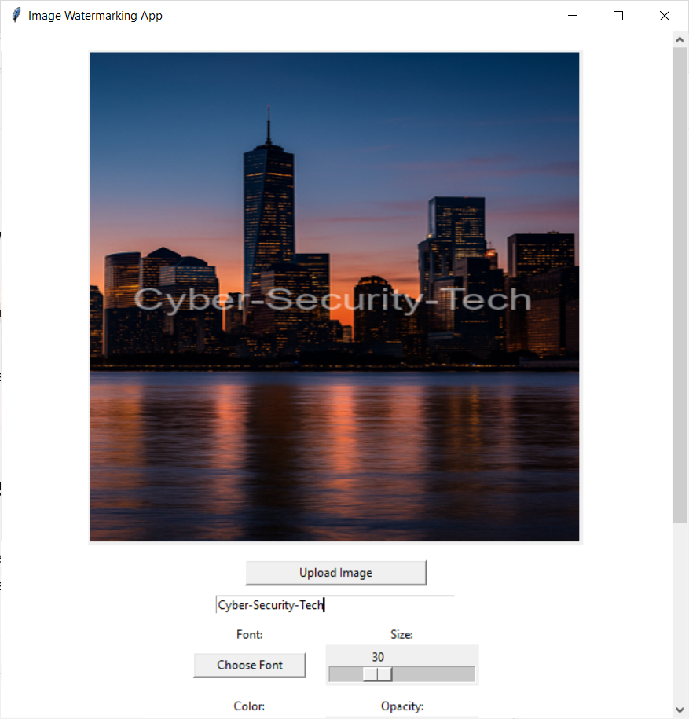
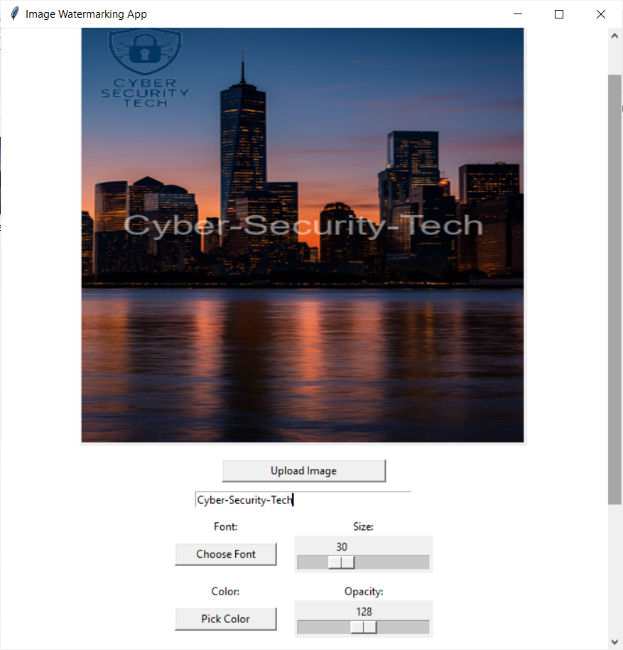
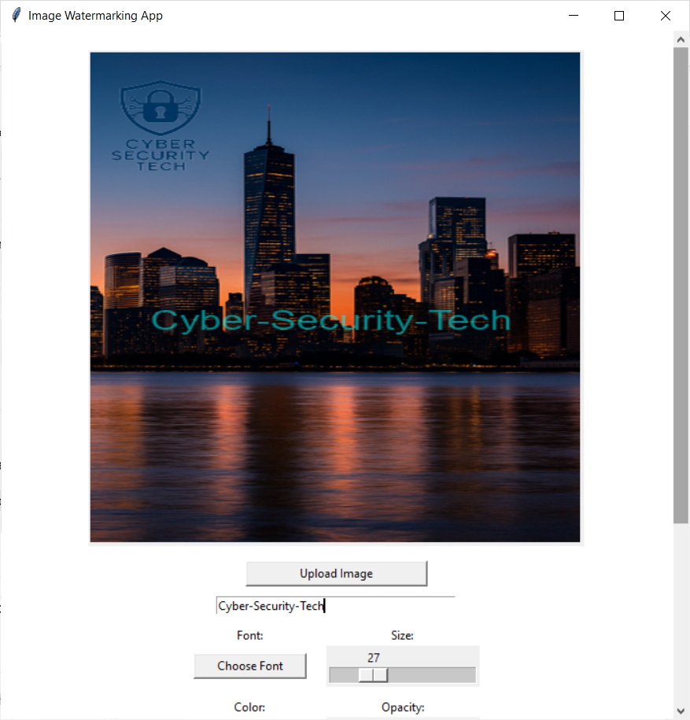

# 🖼️ Image Watermarking App

A full-featured desktop application built with Python and Tkinter that allows users to add text or logo watermarks to images with powerful customization options.

---

## 🎥 Demo


---

## 🚀 Features

- ✅ Upload any image and add a custom watermark
- ✅ Add either **text** or **logo** (or both!) as a watermark
- ✅ **Drag and drop** to reposition the watermark on the image
- ✅ Customize text:
  - Font family
  - Font size
  - Text color
  - Opacity
- ✅ Resize logos dynamically
- ✅ Add multiple layers: text + logo
- ✅ **Undo and Redo** support (with full action history)
- ✅ Smart warning if watermark might get cut off
- ✅ Transparent checkerboard background preview
- ✅ Scrollable responsive UI for smaller windows

---

## 🖼️ Screenshots

| Initial View | Text Watermark | Logo Watermark | Undo/Redo |
|--------------|----------------|----------------|-----------|
|  |  |  |  |

---

## 🛠️ Tech Stack

- **Python 3**
- **Tkinter** (GUI)
- **Pillow (PIL)** – Image processing

---

## 📚 What I Learned

This project helped solidify several key programming skills:
- 🧠 **Object-Oriented Design**: Using a `WatermarkApp` class to handle state and logic
- 🎨 **GUI Development**: Scrollable, dynamic interfaces in Tkinter
- 🖼️ **Image Manipulation**: Transparent overlays, layering, resizing, and blending
- 🕹️ **Drag-and-Drop**: Interactive repositioning of both text and logos
- 🔁 **Undo/Redo**: Implementing state history with deep copies
- ⚠️ **UX Warnings**: Dynamic validation and visual safeguards

---

## 💾 How to Run

1. Clone the repo:
```bash
git clone https://github.com/Cyber-Security-Tech/image-watermarking-app
```

2. Install dependencies:
```bash
pip install pillow
```

3. Run the app:
```bash
python main.py
```

---

## 📂 File Structure

```
image-watermarking-app/
├── main.py
├── ui.py
├── file_manager.py
├── watermark.py
├── assets/
│   └── checkerboard_bg.png
├── media/
│   ├── demo/
│   │   └── demo.gif
│   └── screenshots/
│       ├── initial_view.png
│       ├── text_watermark.png
│       ├── logo_watermark.png
│       └── undo_redo.png
└── README.md
```


- `main.py` / `ui.py` — App entry and GUI logic
- `file_manager.py` — Load/save helper functions
- `watermark.py` — Watermark rendering logic
- `media/screenshots/` — App screenshots
- `media/demo/` — Demo GIF
- `README.md` — This file

---

## 🔮 Future Ideas

- Add watermark **presets**
- Option to **batch watermark** multiple images
- Save/export watermark styles
- Real-time **zoom** and pan controls

---

This project demonstrates real-world GUI programming and image processing with Python.
